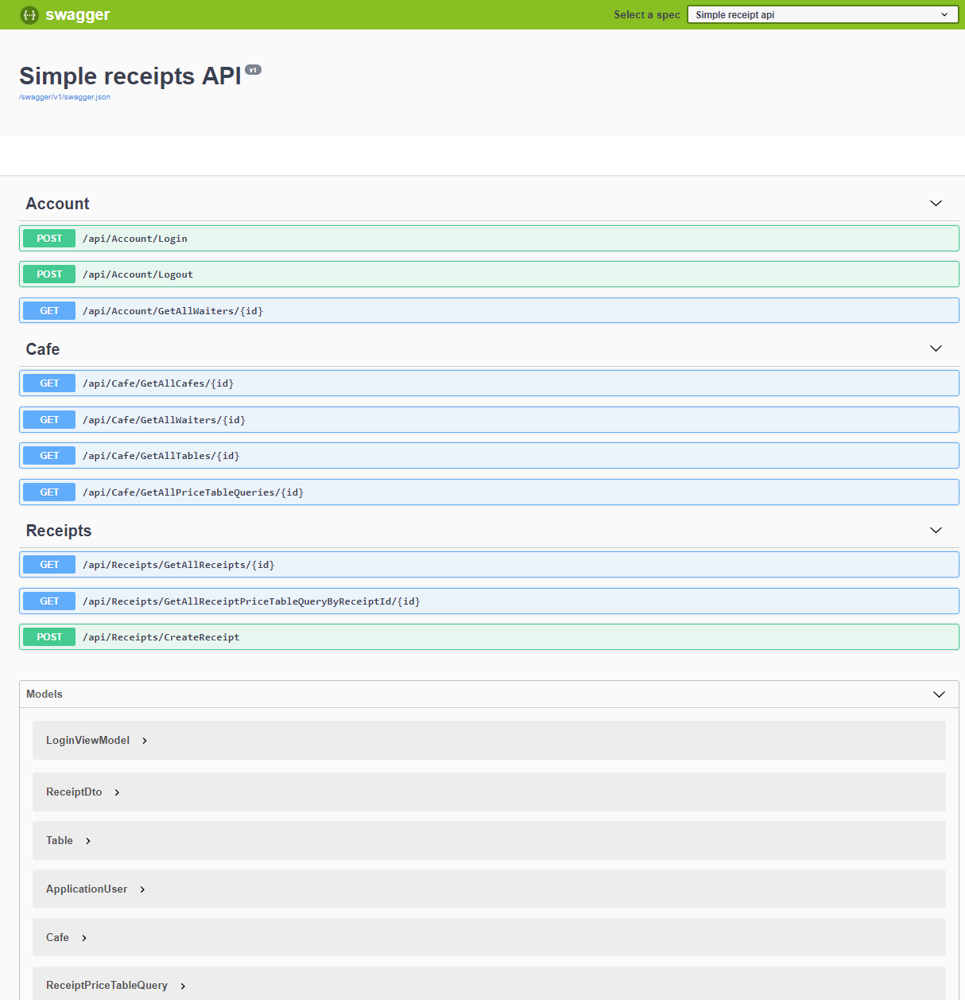
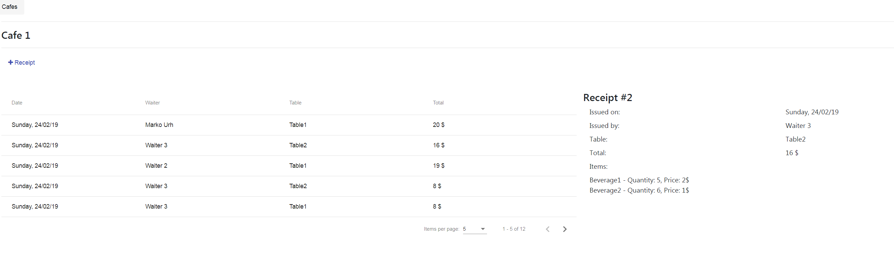
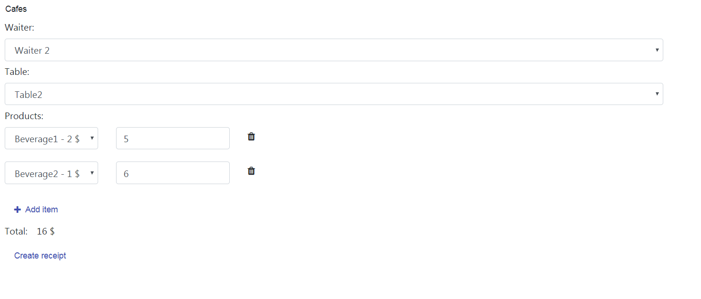

# SimpleReceipt

Clone repo
Make sure you have admin rights

Backend project:
<ul>
  <li>Open project</li>
  <li>Set api project as startup</li>
  <li>Configure connection string in appSettings.json</li>
  <li>Start</li>
  <li>http://localhost:65389/api/index.html</li>
</ul>

Frontend project:
<ul>
  <li>Open project</li>
  <li>Run "npm install" to setup dependencies</li>
  <li>Run "ng serve"</li>
  <li>Start</li>
  <li>http://localhost:4200/#/</li>
</ul>
  

 Contact urh.marko@gmail.com for troubleshooting assistance 

<h4>App</h4>
<ul>
  <li>Navbar contains available cafes from company</li>
  <li>Receipts component contains list of recipes and their details</li>
  <li>Pressing add receipt button you go to edit new receipt and add beverages</li>
  <li>Saving returns you back to receipt component</li>
  <li>Task and UI was ment to be simple - demo of relevant db/api coding</li>
</ul>

 

 

